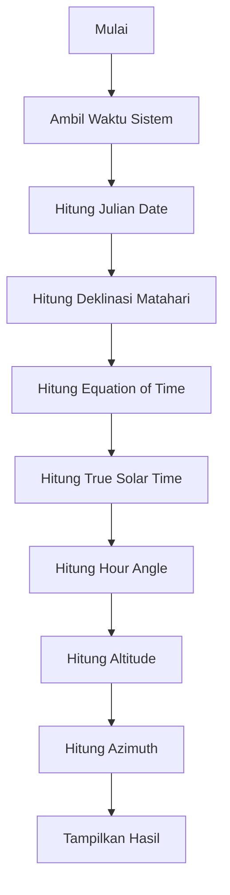

# HelioCelestia ☀︎


```txt
kalkulator posisi matahari | c++ | cli tool | astronomi ( •̀ ω •́ )✧
```

HelioCelestia adalah **tools berbasis CLI** untuk menghitung posisi Matahari
(**Altitude & Azimuth**) berdasarkan lokasi pengamat dan waktu sistem.

Program ini menggunakan konsep:

* Trigonometri bola
* Waktu astronomi (Julian Date)
* Koreksi waktu matahari (Equation of Time)

Ringan, akurat, dan cocok untuk belajar maupun eksplorasi ilmiah.

---

## ⊹₊ Fitur

```txt
[✓] Mendukung koordinat global (latitude, longitude, timezone)
[✓] Otomatis menggunakan waktu sistem
[✓] Menggunakan Equation of Time (EoT)
[✓] Mode CLI (cepat & bisa untuk scripting)
[✓] Mode interaktif
[✓] Output JSON (--json)
[✓] Debug mode (compile-time)
```

---

## ❏ Requirements

```bash
g++ (compiler C++)
```

Tanpa library tambahan. Pure C++.

---

## ⌯⌲ Cara Menjalankan

Clone repository:

```bash
git clone https://github.com/AikoAii/HelioCelestia.git
cd HelioCelestia
```

Compile:

```bash
g++ main.cpp SunPosition.cpp utils.cpp -o heliocelestia
```

Debug mode:

```bash
g++ main.cpp SunPosition.cpp utils.cpp -DDEBUG -o heliocelestia
```

---

## </> Penggunaan

### Mode CLI

```bash
./heliocelestia --lat <value> --lon <value> --tz <value>
```

### Mode JSON

```bash
./heliocelestia --lat <value> --lon <value> --tz <value> --json
```

### Mode Interaktif

```bash
./heliocelestia
```

---

## 🗒 Contoh Output

```txt
------------------ HASIL ------------------
Tinggi Sudut Matahari (ALT) : 27.3 derajat
Azimuth Matahari (AZI)      : 110.2 derajat
--------------------------------------------
```

```json
{
  "altitude": 27.3,
  "azimuth": 110.2
}
```

---

# ➢ Cara Kerja Program (Intuisi → Konsep)

## ⃝ Intuisi Dasar

Posisi Matahari di langit tergantung:

* lokasi kita di Bumi
* waktu saat pengamatan

Tujuan program ini:

> mengubah posisi Matahari dari sistem astronomi → posisi yang bisa kita lihat di langit

---

## ⤷ Konsep yang Digunakan

### 1. Julian Date (JD)

Julian Date adalah sistem waktu kontinu dalam astronomi.

Digunakan agar:

```txt
perhitungan waktu jadi konsisten secara global
```

---

### 2. Deklinasi Matahari (DES)

Deklinasi = sudut Matahari terhadap ekuator langit.

```txt
- berubah setiap hari
- menentukan tinggi Matahari di langit
```

---

### 3. Equation of Time (EoT)

Matahari tidak selalu tepat di atas kepala jam 12.

```txt
penyebab:
- orbit bumi elips
- kemiringan sumbu bumi
```

EoT digunakan untuk mengoreksi waktu menjadi:

```txt
True Solar Time
```

---

### 4. Hour Angle (HAS)

Hour Angle menunjukkan posisi Matahari relatif terhadap tengah hari.

```txt
pagi  → negatif
siang → 0
sore  → positif
```

---

### 5. Konversi ke Koordinat Horizontal

Dari:

```txt
Deklinasi + Hour Angle
```

Menjadi:

```txt
Altitude (ALT) → tinggi Matahari dari horizon
Azimuth  (AZI) → arah Matahari (kompas)
```

---

## ✎ Rumus yang Digunakan

### - Altitude

```txt
sin(ALT) = cos(DES)·cos(HAS)·cos(PHI) + sin(DES)·sin(PHI)
```

---

### - Azimuth

```txt
AZI = atan2( sin(HAS), cos(HAS)·sin(PHI) - tan(DES)·cos(PHI) )
```

---

### - Hour Angle

```txt
HAS = 15 × (Solar Time - 12)
```

---

### - Solar Time

```txt
Solar Time = Clock Time + Koreksi Longitude + EoT
```

---

## ⟳ Alur Perhitungan

```txt
1. Ambil waktu sistem
2. Hitung Julian Date
3. Hitung Deklinasi Matahari
4. Hitung Equation of Time
5. Hitung True Solar Time
6. Hitung Hour Angle
7. Hitung Altitude & Azimuth
8. Tampilkan hasil
```

---

## ⌬ Flowchart Perhitungan



---

## ⇄ Range Input

```txt
Latitude  : -90 → 90
Longitude : -180 → 180
Timezone  : -12 → 14
```

---

## ⊙ Kenapa Project Ini?

```txt
- Belajar astronomi komputasional
- Memahami trigonometri bola
- Membuat CLI tool nyata
- Menghubungkan matematika dengan dunia nyata
```

---

## 🗐 License

MIT License — bebas digunakan dan dikembangkan.

---

```txt
langit itu bisa dihitung, bukan cuma dilihat
banyak keajaiban yang terjadi di atas langit
dan merupakan bentuk kekuasaan Tuhan.
```
