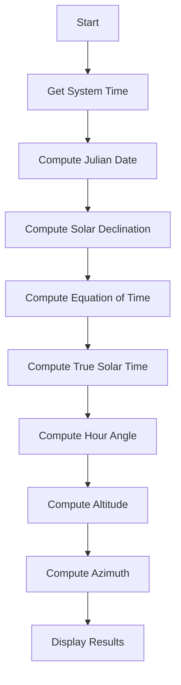

# HelioCelestia ☀︎


```txt
solar position calculator | c++ | cli tool | astronomy ( •̀ ω •́ )✧
```

HelioCelestia is a **CLI-based tool** for calculating the Sun’s position
(**Altitude & Azimuth**) based on observer location and system time.

This program is built using:

* Spherical trigonometry
* Astronomical time (Julian Date)
* Solar time correction (Equation of Time)

Lightweight, accurate, and suitable for both learning and real-world exploration.

---

## ⊹₊ Features

```txt
[✓] Supports global coordinates (latitude, longitude, timezone)
[✓] Uses system time automatically
[✓] Implements Equation of Time (EoT)
[✓] CLI mode (fast & scriptable)
[✓] Interactive mode
[✓] JSON output (--json)
[✓] Debug mode (compile-time)
```

---

## ❏ Requirements

```bash
g++ (C++ compiler)
```

No external libraries required. Pure C++.

---

## ⌯⌲ Getting Started

Clone the repository:

```bash
git clone https://github.com/AikoAii/HelioCelestia.git
cd HelioCelestia
```

Compile:

```bash
g++ main.cpp SunPosition.cpp utils.cpp -o heliocelestia
```

Debug mode:

```bash
g++ main.cpp SunPosition.cpp utils.cpp -DDEBUG -o heliocelestia
```

---

## </> Usage

### CLI Mode

```bash
./heliocelestia --lat <value> --lon <value> --tz <value>
```

### JSON Mode

```bash
./heliocelestia --lat <value> --lon <value> --tz <value> --json
```

### Interactive Mode

```bash
./heliocelestia
```

---

## 🗒 Example Output

```txt
------------------ RESULT ------------------
Solar Altitude (ALT) : 27.3 degrees
Solar Azimuth  (AZI) : 110.2 degrees
--------------------------------------------
```

```json
{
  "altitude": 27.3,
  "azimuth": 110.2
}
```

---

# ➢ How It Works (Intuition → Concept)

## ⃝ Basic Intuition

The position of the Sun in the sky depends on:

* the observer’s location on Earth
* the time of observation

The goal of this program is:

> to transform the Sun’s position from astronomical coordinates
> into a position that can be observed directly in the sky

---

## ⤷ Concepts Used

### 1. Julian Date (JD)

Julian Date is a continuous time system used in astronomy.

```txt
used to ensure consistent time calculations globally
```

---

### 2. Solar Declination (DES)

Declination is the angle between the Sun and the celestial equator.

```txt
- changes every day
- determines the Sun’s height in the sky
```

---

### 3. Equation of Time (EoT)

The Sun is not always exactly overhead at 12:00.

```txt
caused by:
- elliptical orbit of Earth
- axial tilt of Earth
```

EoT is used to correct time into:

```txt
True Solar Time
```

---

### 4. Hour Angle (HAS)

Hour Angle represents the Sun’s position relative to solar noon.

```txt
morning  → negative
noon     → 0
afternoon → positive
```

---

### 5. Conversion to Horizontal Coordinates

From:

```txt
Declination + Hour Angle
```

Into:

```txt
Altitude (ALT) → height above the horizon
Azimuth  (AZI) → direction (compass)
```

---

## ✎ Formulas Used

### - Altitude

```txt
sin(ALT) = cos(DES)·cos(HAS)·cos(PHI) + sin(DES)·sin(PHI)
```

---

### - Azimuth

```txt
AZI = atan2( sin(HAS), cos(HAS)·sin(PHI) - tan(DES)·cos(PHI) )
```

---

### - Hour Angle

```txt
HAS = 15 × (Solar Time - 12)
```

---

### - Solar Time

```txt
Solar Time = Clock Time + Longitude Correction + EoT
```

---

## ⟳ Calculation Flow

```txt
1. Get system time
2. Compute Julian Date
3. Compute Solar Declination
4. Compute Equation of Time
5. Compute True Solar Time
6. Compute Hour Angle
7. Compute Altitude & Azimuth
8. Display results
```

---

## ⌬ Calculation Flowchart



---

## ⇄ Input Range

```txt
Latitude  : -90 → 90
Longitude : -180 → 180
Timezone  : -12 → 14
```

---

## ⊙ Why This Project?

```txt
- Learn computational astronomy
- Understand spherical trigonometry
- Build real-world CLI tools
- Connect mathematics with real-world phenomena
```

---

## 🗐 License

MIT License — free to use and modify.

---

```txt
the sky can be calculated, not just observed
many wonders exist above us
and all of it reflects the order of the universe
```
