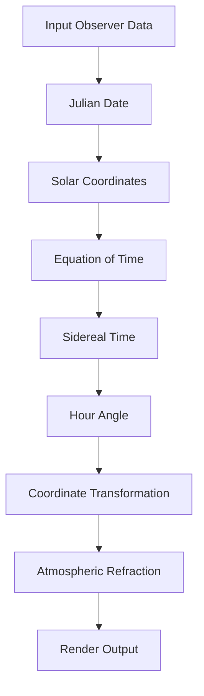

# HelioCelestia


> A modern scientific CLI astronomy engine written in C++20.

HelioCelestia computes the Sun’s position in the sky for any observer location and time using real astronomical models, spherical trigonometry, and atmospheric correction algorithms.

Designed as both:

* a lightweight professional astronomy CLI tool
* an educational computational astronomy project

---

# Features

* Julian Date calculation (Meeus Ch.7)
* Greenwich & Local Sidereal Time
* Solar equatorial coordinate computation
* Equatorial → Horizontal coordinate transformation
* Atmospheric refraction correction
* Sunrise, Solar Noon, and Sunset calculation
* Moon position calculation
* Polar day / polar night detection
* Twilight zone classification
* JSON output support
* CLI argument mode
* Interactive mode
* Leap-year aware input validation
* Unit and integration testing
* GitHub Actions CI pipeline

---

# Scientific Model

HelioCelestia combines multiple astronomical and mathematical concepts:

* Julian Date system
* Solar declination models
* Equation of Time (EoT)
* Sidereal time computation
* Spherical trigonometry
* Coordinate system transformations
* Atmospheric refraction correction
* Low-precision lunar position modelling

The project follows references from:

* Jean Meeus — *Astronomical Algorithms*
* NOAA Solar Calculator
* Bennett atmospheric refraction model

---

# Requirements

* **C++20** compiler

  * GCC 13+ recommended
  * Clang 16+ recommended
* **CMake 3.20+**
* No external dependencies

---

# Build

```bash
git clone https://github.com/AikoAii/HelioCelestia.git
cd HelioCelestia

cmake -B build -DCMAKE_BUILD_TYPE=Release
cmake --build build --parallel
```

Binary output:

```bash
build/heliocelestia_cli
```

---

# Run Tests

```bash
ctest --test-dir build --output-on-failure
```

---

# Usage

## CLI Mode

```bash
./build/heliocelestia_cli \
  --latitude 51.5 --longitude -0.12 \
  --year 2025 --month 6 --day 21 \
  --hour 12 --minute 0 --timezone 1
```

---

## JSON Output

```bash
./build/heliocelestia_cli \
  --latitude 51.5 --longitude -0.12 \
  --year 2025 --month 6 --day 21 \
  --hour 12 --minute 0 --timezone 1 \
  --json
```

---

## Sunrise / Sunset Calculation

```bash
./build/heliocelestia_cli \
  --latitude 51.5 --longitude -0.12 \
  --year 2025 --month 6 --day 21 \
  --hour 12 --minute 0 --timezone 1 \
  --sunrise
```

---

## Moon Position

```bash
./build/heliocelestia_cli \
  --latitude 51.5 --longitude -0.12 \
  --year 2025 --month 6 --day 21 \
  --hour 12 --minute 0 --timezone 0 \
  --moon
```

Moon output includes altitude, azimuth, equatorial coordinates, ecliptic
coordinates, and approximate Earth-Moon distance.

---

## Verbose Mode

```bash
./build/heliocelestia_cli ... --verbose
```

---

## Interactive Mode

```bash
./build/heliocelestia_cli
```

---

# Example Output

```txt
╔══════════════════════════════════════════╗
║           HelioCelestia Report           ║
╚══════════════════════════════════════════╝

  Solar Position
  ─────────────────────────────────────────
  Altitude (geometric)   :    58.2847°
  Altitude (apparent)    :    58.2874°
  Azimuth                :   179.4312°
  Declination            :    23.4282°
  Right Ascension        :    91.3471°
  Julian Date            : 2460846.95833

  Status  : Sun Visible

  Day Events
  ─────────────────────────────────────────
  Sunrise    : 04:43 UTC
  Solar Noon : 12:01 UTC
  Sunset     : 21:21 UTC

  Moon Position
  ─────────────────────────────────────────
  Altitude          :    12.3000°
  Azimuth           :   210.4000°
  Distance          :    380000 km
```

---

## JSON Example

```json
{
  "observer": {
    "latitude_deg": 51.5000,
    "longitude_deg": -0.1200,
    "elevation_m": 0.0
  },
  "solar_position": {
    "altitude_deg": 58.2847,
    "altitude_corrected_deg": 58.2874,
    "azimuth_deg": 179.4312,
    "declination_deg": 23.4282,
    "julian_date": 2460846.95833,
    "status": "visible"
  }
}
```

---

# How It Works

## Basic Intuition

The Sun’s apparent position depends on:

* observer location on Earth
* date and time of observation
* Earth rotation and orbital mechanics

HelioCelestia transforms astronomical coordinates into directly observable sky coordinates.

---

# Core Concepts

## 1. Julian Date

A continuous astronomical time system used for stable and precise calculations.

---

## 2. Solar Declination

The angular distance between the Sun and the celestial equator.

This changes continuously throughout the year due to Earth’s axial tilt.

---

## 3. Equation of Time (EoT)

Corrects the difference between:

* solar time
* clock time

Caused by:

* Earth’s elliptical orbit
* axial tilt

---

## 4. Hour Angle (HA)

Represents the Sun’s angular displacement relative to solar noon.

* morning → negative
* solar noon → zero
* afternoon → positive

---

## 5. Horizontal Coordinate Transformation

Converts astronomical coordinates into:

* Altitude → height above horizon
* Azimuth → compass direction

---

# Important Equations

## Altitude Formula

```txt
sin(h) = cos(δ)cos(H)cos(φ) + sin(δ)sin(φ)
```

---

## Azimuth Formula

```txt
A = atan2(sin(H), cos(H)sin(φ) − tan(δ)cos(φ))
```

---

## Hour Angle

```txt
H = 15 × (Solar Time − 12)
```

---

# Calculation Pipeline

```txt
1. Get observer date & time
2. Compute Julian Date
3. Compute solar coordinates
4. Compute Equation of Time
5. Compute sidereal time
6. Compute Hour Angle
7. Transform coordinates
8. Apply atmospheric correction
9. Render final output
```

---

# Flowchart


```mermaid
flowchart TD
    A[Input Observer Data] --> B[Julian Date]
    B --> C[Solar Coordinates]
    C --> D[Equation of Time]
    D --> E[Sidereal Time]
    E --> F[Hour Angle]
    F --> G[Coordinate Transformation]
    G --> H[Atmospheric Refraction]
    H --> I[Render Output]
```

---

# Input Range

| Parameter | Range      |
| --------- | ---------- |
| Latitude  | -90 → 90   |
| Longitude | -180 → 180 |
| Timezone  | -12 → 14   |

---

# Architecture

```txt
heliocelestia/
├── apps/cli/
├── include/heliocelestia/
│   ├── astronomy/
│   ├── cli/
│   ├── core/
│   ├── io/
│   ├── math/
│   ├── models/
│   ├── services/
│   └── validation/
├── src/
├── tests/
├── docs/
└── CMakeLists.txt
```

See:

```txt
docs/architecture.md
```

for a detailed layer diagram and system overview.

---

# Why This Project?

HelioCelestia was built to:

* explore computational astronomy
* understand spherical trigonometry
* study scientific software engineering
* connect mathematics with observable real-world phenomena
* build a modern production-style C++ CLI application

---

# Scientific References

* Jean Meeus — *Astronomical Algorithms* (2nd Edition)

  * Ch.7 — Julian Date
  * Ch.12 — Sidereal Time
  * Ch.15 — Sunrise/Sunset
  * Ch.25 — Solar Coordinates

* G.G. Bennett (1982)
  *The Calculation of Astronomical Refraction in Marine Navigation*

* NOAA Solar Calculator

---

# License

MIT License — free to use, study, modify, and distribute.

---

```txt
the sky can be calculated, not just observed
```
